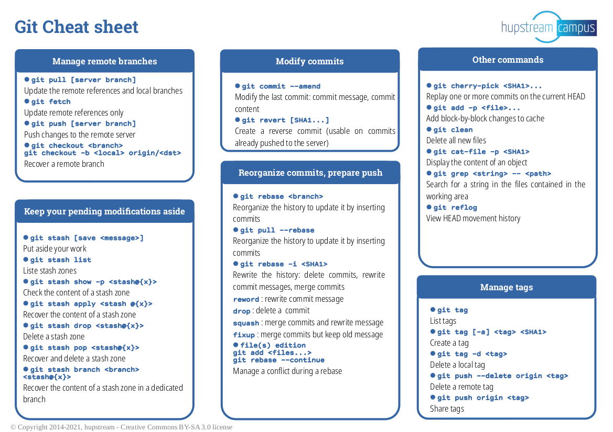
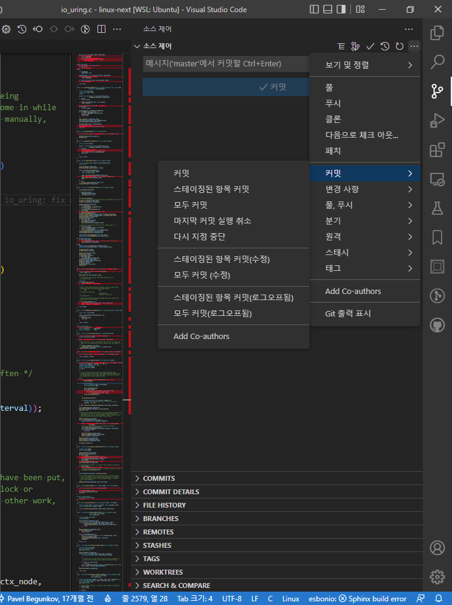
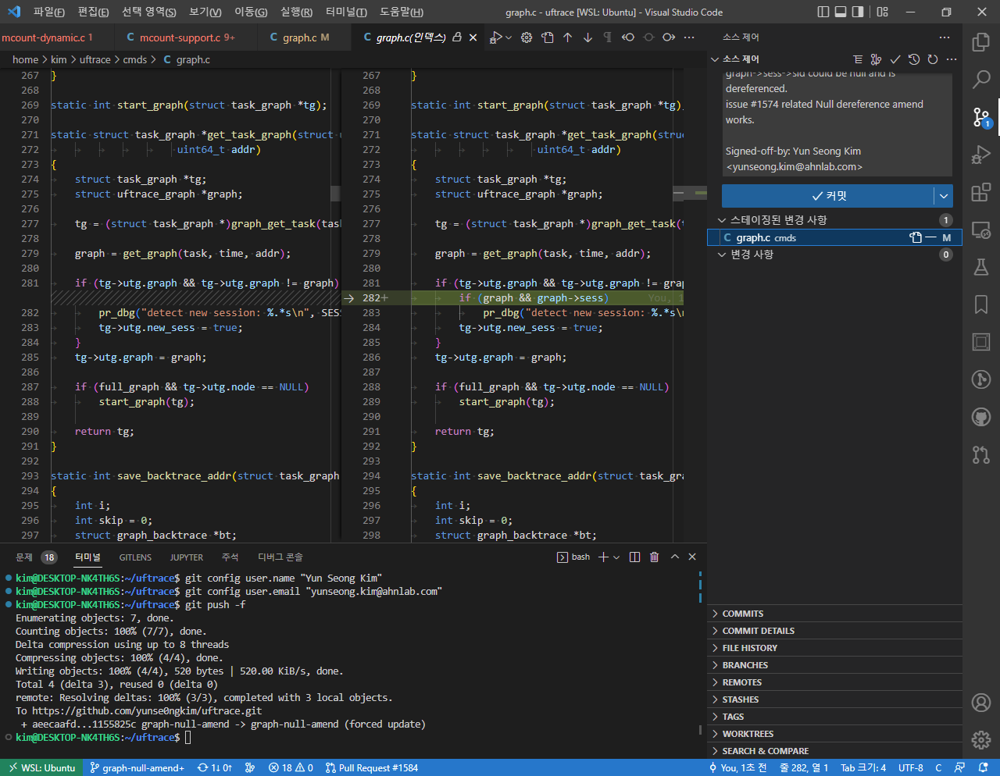

+++
title = "Opensource Contribution with VS Code embeded Git Utility"
outputs = ["Reveal"]
[logo]
src = "github-logo.png"
[reveal_hugo]
custom_theme = "reveal-hugo/themes/robot-lung.css"
margin = 0.2
weight = 10
+++

## VS Code 를 활용한 Git

- 마이크로소프트 윈도우, macOS, 리눅스용으로 electron(node.js) 기반 편집기입니다.
- Plugin 을 추가하여 풍부한 기능을 가진 IDE 로 사용할 수 있습니다.
- VS Code 자체적으로 지원하는 Git 기능이 참 편리합니다.
  - 철권처럼 커맨드를 조합하여 사용하는 기능을 버튼 하나로 함축했습니다.
- 추가적으로 Git 기능 외에도 SSH 또는 Live Share 원격 개발 환경 및 멀티 유저 편집이 가능합니다.

---

## Git Command



---

## VS Code 를 활용한 Git



---

## Git History

- History 그래프를 볼 때 유용한 Git History 플러그인
- 커밋 히스토리를 보기 위한 `git log`, 특정 커밋의 시점으로 바꾸는 `git checkout` 에 대응하는 기능인데 직관적으로 보기 편합니다.

<br>

<a href="http://www.youtube.com/watch?feature=player_embedded&v=hW6mhIaZjgw
" target="_blank"></a>

---

## Git Lens

- 코드 라인 & 파일 별 히스토리 추적에 용이한 Git Lens 플러그인

<br>

<a href="http://www.youtube.com/watch?feature=player_embedded&v=WzIpMlS89HI
" target="_blank"></a>

---

## CONTRIBUTING
- 오픈소스 프로젝트
  - *Github*, Gitlab, cgit 등의 git 기반 호스팅에 레포지토리들
- 각 프로젝트에 Core, Util, Docs, unit-test, run-test, CI/CD 등에 기여합니다.
  - 1. 게시판 형태의 플랫폼은 issue 를 확인
  - 2. 메일링 기반은 메일링 등록
- 각 프로젝트마다 wiki 나 최상단에 컨트리뷰션 가이드 문서가 있습니다.
  - [pytorch - CONTRIBUTING.md](https://github.com/pytorch/pytorch/blob/master/CONTRIBUTING.md)
  - [ebpf-for-windows - CONTRIBUTING.md](https://github.com/microsoft/ebpf-for-windows/blob/main/CONTRIBUTING.md)
  - [Linux Kernel - Patch submission notes](https://www.kernel.org/doc/html/latest/process/maintainer-tip.html?highlight=x86#patch-submission-notes)

---

## Contribution - Review

국제적으로 메일링 기록이 남기 때문에,
메인테이너들이 사소한 패치라도 신중하게 리뷰해줍니다.
특히, 컴파일된 코드 관련해서는 패치를 보낸 기여자를 설득하기 위해서
어려운 동작을 자세히 설명해주어 많은 도움이 되었습니다.

---

## Github Uftrace - Commit

코드 정적 분석기로 나온 항목 중에 Null 관련 보안 사항이 있었습니다.
```patch
cmds/graph.c:282: error: Null Dereference
  pointer `graph` last assigned on line 279 could be null 
  and is dereferenced at line 282, column 3.
  280.
  281.  if (tg->utg.graph && tg->utg.graph != graph) {
  282.          pr_dbg("detect new session: %.*s\n", SESSION_ID_LEN, graph->sess->sid);
         ^
  283.          tg->utg.new_sess = true;
  284.  }
```

깃허브 이슈로 등록한 뒤에 해당 사항을 보완하는 작업을 진행합니다.

<a href="http://www.youtube.com/watch?feature=player_embedded&v=JDUcRbE1AsU
" target="_blank"></a>

---

### Before PR

커밋을 하고 난 뒤에 *마지막 커밋 실행 취소*로 쉽게 스테이징 단계로 되돌아 올 수 있습니다.  

<br>

코드리뷰를 받고 보완할 부분이 있다면, 활용하면 좋습니다.  

<a href="http://www.youtube.com/watch?feature=player_embedded&v=TIVsQCtw9ME
" target="_blank"></a>

---

### Before PR

커밋하고 푸쉬로 origin 브랜치에 반영되었는데 또 수정이 필요하다면?  
커밋을 다시할 필요 없이 마지막 커밋을 `git push -f` 로 덮어 써줍니다.  



---

## PR

fork 한 브랜치(Downstream)를 origin(Upstream)에 머지할 수 있도록 PR 을 작성하는 단계입니다.

<a href="http://www.youtube.com/watch?feature=player_embedded&v=wr6dkL0FGPA
" target="_blank"></a>

---

## Linux Kernel - Send Patch

소스 최상단의 `MAINTAINERS` 참고하여 github 와 1 ~ 2 와 유사하지만, PR 과 코드 리뷰를 모두 담당자의 메일로 보냅니다.

```bash
git send-email --smtp-pass="비밀번호" \
  --to="메인테이너@이메일.주소" \
  --cc="참조할@메일.주소들" \
  --confirm=always -M -1
```
뒤에 카운트는 작업한 커밋 개수를 넣습니다.
```bash
git send-email \
  --to="Thomas Gleixner <tglx@linutronix.de>, Marc Zyngier <maz@kernel.org>"
  --cc="linux-kernel@vger.kernel.org, Austin Kim <austindh.kim@gmail.com>"
  --confirm=always -M -1
```

### Send Patch(Cont'd)

커밋 메세지를 작성할 때, 영어 작문 실력이 필요하지만,  
우리에겐 *구글 번역기*가 있습니다.

```patch
Hello

Since we have a macro defined in our IRQ subsystem internal functions to
traverse the list of actions, how about refactoring this loop?

- genirq: Use a common macro to go through the actions list
(f944b5a7aff05a244a6c8cac297819af09a199e4)

have a good day!

---
 kernel/irq/irqdesc.c | 4 ++--
 1 file changed, 2 insertions(+), 2 deletions(-)

diff --git a/kernel/irq/irqdesc.c b/kernel/irq/irqdesc.c
index 939d21cd55c3..34a0cefff712 100644
--- a/kernel/irq/irqdesc.c
+++ b/kernel/irq/irqdesc.c
@@ -246,12 +246,12 @@ static ssize_t actions_show(struct kobject *kobj,
 			    struct kobj_attribute *attr, char *buf)
 {
 	struct irq_desc *desc = container_of(kobj, struct irq_desc, kobj);
-	struct irqaction *action;
+	struct irqaction *action = NULL;
 	ssize_t ret = 0;
 	char *p = "";
 
 	raw_spin_lock_irq(&desc->lock);
-	for (action = desc->action; action != NULL; action = action->next) {
+	for_each_action_of_desc(desc, action) {
 		ret += scnprintf(buf + ret, PAGE_SIZE - ret, "%s%s",
 				 p, action->name);
 		p = ",";
-- 
```

---

### Maintainer's Code Review

보낸 패치에 대해서 보완해야할 사항을 해당 서브시스템의 메인테이너가 말해줍니다.

```patch
Re: [PATCH] genirq: Refactor actions_show loop block using a common macro to go through the actions list
    - by Thomas Gleixner @ 2022-04-10 19:17 UTC [7%]

On Fri, Apr 08 2022 at 20:41, you wrote:

thanks for providing this patch.

> Hello.
>
> Since we have a macro defined in our IRQ subsystem internal functions to
> traverse the list of actions, how about refactoring this loop?
>
> - genirq: Use a common macro to go through the actions list
> (f944b5a7aff05a244a6c8cac297819af09a199e4)
>
> have a good day!

Neither 'Hello' nor 'have a good day' are part of the change log.

Also please write the changelog in a factual way and not in form of a
question. If you want to add a reference to a git commit, then please
use the canonical form as described in Documentation/process, where you
also find the general patch submission rules. There is also a tip tree
specific chapter:

https://www.kernel.org/doc/html/latest/process/maintainer-tip.html?highlight=x86#patch-submission-notes

Following these rules makes everyones life simpler.

> ---
>  kernel/irq/irqdesc.c | 4 ++--
>  1 file changed, 2 insertions(+), 2 deletions(-)
>
> diff --git a/kernel/irq/irqdesc.c b/kernel/irq/irqdesc.c
> index 939d21cd55c3..34a0cefff712 100644
> --- a/kernel/irq/irqdesc.c
> +++ b/kernel/irq/irqdesc.c
> @@ -246,12 +246,12 @@ static ssize_t actions_show(struct kobject *kobj,
>  			    struct kobj_attribute *attr, char *buf)
>  {
>  	struct irq_desc *desc = container_of(kobj, struct irq_desc, kobj);
> -	struct irqaction *action;
> +	struct irqaction *action = NULL;

There is no NULL initialization required.

Thanks,

        tglx
```

---

### Resend Patch V2

보완한 패치를 다시 보냅니다. 서브시스템의 메인테이너가 말해줍니다.

```patch
Refactor for loop to macro for_each_action_of_desc

---
 kernel/irq/irqdesc.c | 2 +-
 1 file changed, 1 insertion(+), 1 deletion(-)

diff --git a/kernel/irq/irqdesc.c b/kernel/irq/irqdesc.c
index d323b180b0f3..5db0230aa6b5 100644
--- a/kernel/irq/irqdesc.c
+++ b/kernel/irq/irqdesc.c
@@ -251,7 +251,7 @@ static ssize_t actions_show(struct kobject *kobj,
 	char *p = "";
 
 	raw_spin_lock_irq(&desc->lock);
-	for (action = desc->action; action != NULL; action = action->next) {
+	for_each_action_of_desc(desc, action) {
 		ret += scnprintf(buf + ret, PAGE_SIZE - ret, "%s%s",
 				 p, action->name);
 		p = ",";
```

---

### Linux Kernel - Check Patch Merge

보낸 패치는 v6.0-rc1 에서 `[GIT pull] irq/core for v6.0-rc1 - by Thomas Gleixner @ 2022-08-01 14:48 UTC [1%]` 머지되었습니다.
```patch
The following commit has been merged into the irq/irqchip-next branch of irqchip:

Commit-ID:     c904cda04482d5ab545e5a82cee6084078ef9543
Gitweb:        https://git.kernel.org/pub/scm/linux/kernel/git/maz/arm-platforms/c904cda04482d5ab545e5a82cee6084078ef9543
AuthorDate:    Sun, 10 Jul 2022 20:26:14 +09:00
Committer:     Marc Zyngier <maz@kernel.org>
CommitterDate: Wed, 20 Jul 2022 15:21:32 +01:00

genirq: Use for_each_action_of_desc in actions_show()

Refactor action_show() to use for_each_action_of_desc instead
of a similar open-coded loop.

[maz: reword commit message]
Signed-off-by: Marc Zyngier <maz@kernel.org>
Link: https://lore.kernel.org/r/20220710112614.19410-1-p4ranlee@gmail.com
---
 kernel/irq/irqdesc.c | 2 +-
 1 file changed, 1 insertion(+), 1 deletion(-)

diff --git a/kernel/irq/irqdesc.c b/kernel/irq/irqdesc.c
index d323b18..5db0230 100644
--- a/kernel/irq/irqdesc.c
+++ b/kernel/irq/irqdesc.c
@@ -251,7 +251,7 @@ static ssize_t actions_show(struct kobject *kobj,
 	char *p = "";
 
 	raw_spin_lock_irq(&desc->lock);
-	for (action = desc->action; action != NULL; action = action->next) {
+	for_each_action_of_desc(desc, action) {
 		ret += scnprintf(buf + ret, PAGE_SIZE - ret, "%s%s",
 				 p, action->name);
 		p = ",";
```

---

# 🤗

고생하셨습니다!

### Contribution - P.S.

기억에 남는 몇 가지 패치 항목들입니다.

1. `Xen Hypervisor` 암묵적인 casting 으로 실제 코드가 길어지는 현상
```patch
From: Julien Grall <julien@xen.org>

Well... I don't think the one less operation is because of introduction 
of the local variable (see more below).

> 
> (1) before clean up
> 
> 0000000000001bb4 <p2m_set_entry>:
>      while ( nr )
>      1bb4:       b40005e2        cbz     x2, 1c70 <p2m_set_entry+0xbc>
> {
>      ...
>          if ( rc )
>      1c1c:       350002e0        cbnz    w0, 1c78 <p2m_set_entry+0xc4>
>          sgfn = gfn_add(sgfn, (1 << order));

1 << order is a 32-bit value but the second parameter is a 64-bit value 
(assuming arm64). So...

>      1c20:       1ad32373        lsl     w19, w27, w19   // <<< CES works
>      1c24:       93407e73        sxtw    x19, w19        // <<< well!

... this instruction is extending the 32-bit value to 64-bit value.

>      return _gfn(gfn_x(gfn) + i);
>      1c28:       8b1302d6        add     x22, x22, x19
>      return _mfn(mfn_x(mfn) + i);
>      1c2c:       8b130281        add     x1, x20, x19
>      1c30:       b100069f        cmn     x20, #0x1
>      1c34:       9a941034        csel    x20, x1, x20, ne  // ne = any
>      while ( nr )
>      1c38:       eb1302b5        subs    x21, x21, x19
>      1c3c:       540001e0        b.eq    1c78 <p2m_set_entry+0xc4>  // b.none
> 
> (2) Using again mask variable. mask = 1UL << order
> code show me   sxtw    x19, w19    operation disappeared.
This code is not only using a local variable but also using "1UL". So, I 
suspect that if you were using 1 << order, the instruction would re-appear.

Cheers,
Julien Grall
```

---

### Contribution - P.S.(Cont'd)

2. `Uftrace` 함수를 뛰어다니는 분기(try-catch 구현) longjmp() 가 컴파일러 최적화로 동작을 안하는 현상
```patch
diff --git a/tests/s-longjmp.c b/tests/s-longjmp.c
index 487e9264..64fc7c38 100644
--- a/tests/s-longjmp.c
+++ b/tests/s-longjmp.c
@@ -8,6 +8,9 @@ int foo(void)
        return 0;
 }

+#if __clang__
+__attribute__((optnone))
+#endif
 int bar(void)
 {
        return -1;

Another solution is to make bar function has more contents
so that it can't be optimized in clang.
```

---

# 🤗

진짜 끝 🤗
